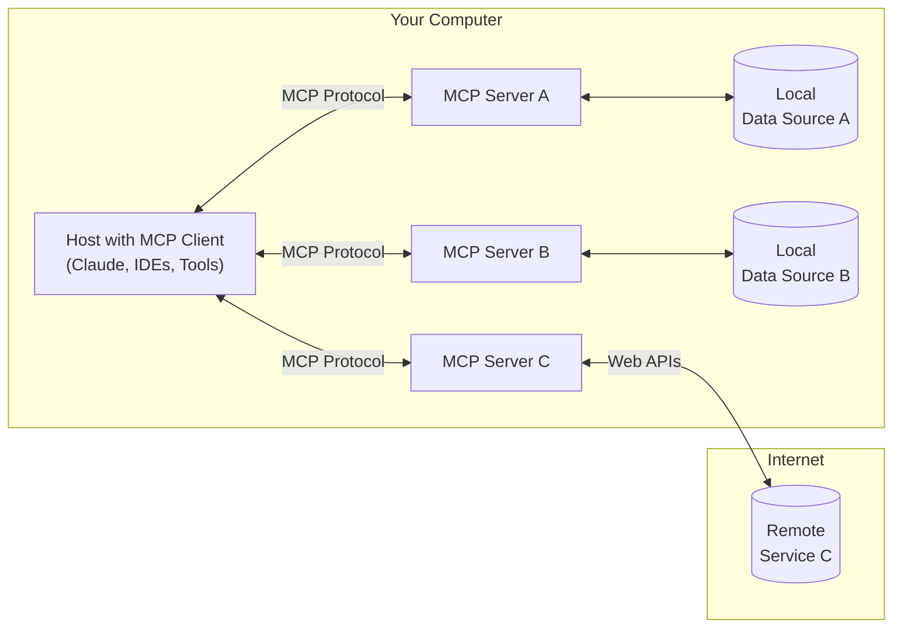
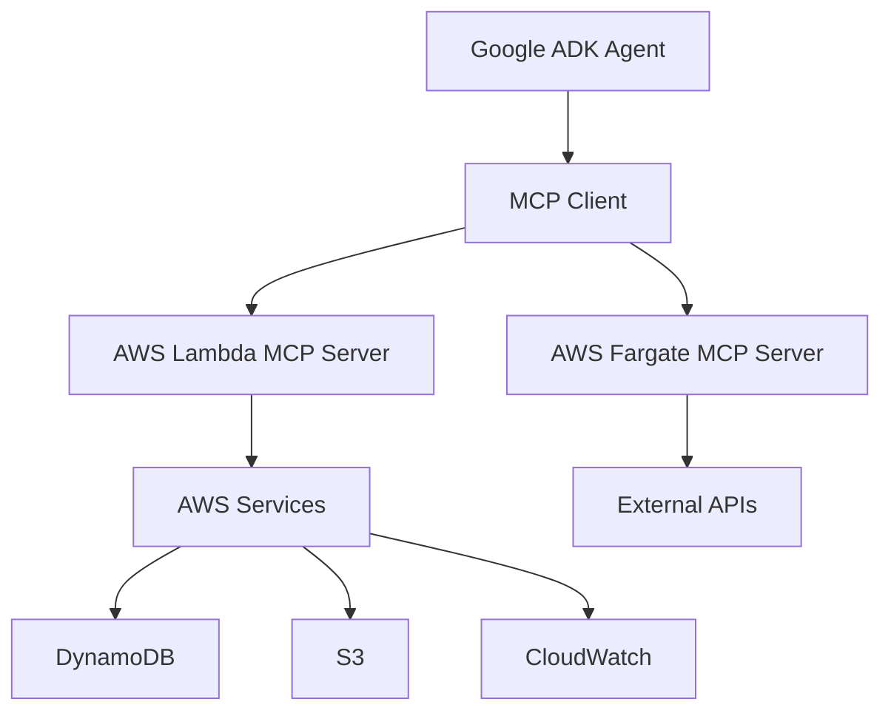

# Cost-Efficient MCP Server Deployment on AWS for AI Agents

A comprehensive guide to deploying Model Context Protocol (MCP) servers on AWS services cost-effectively and integrating them with AI agent frameworks like Google ADK.

## Table of Contents

1. [What is MCP? (Start Here)](#what-is-mcp-start-here)
2. [Prerequisites](#prerequisites)
3. [Quick Start Guide](#quick-start-guide)
4. [MCP Architecture Fundamentals](#mcp-architecture-fundamentals)
5. [AWS Deployment Options](#aws-deployment-options)
6. [Cost Comparison Analysis](#cost-comparison-analysis)
7. [Recommended Deployment Strategies](#recommended-deployment-strategies)
8. [Step-by-Step Implementation](#step-by-step-implementation)
9. [Google ADK Integration](#google-adk-integration)
10. [Troubleshooting](#troubleshooting)
11. [Monitoring and Optimization](#monitoring-and-optimization)
12. [Best Practices](#best-practices)
13. [Resources](#resources)

## What is MCP? (Start Here)

**Model Context Protocol (MCP)** is like a universal translator that allows AI applications (like Claude, ChatGPT, or Google's AI agents) to connect to external tools and data sources in a standardized way.

### Think of it this way:
- **Without MCP**: Each AI tool needs custom code to connect to databases, APIs, or services
- **With MCP**: AI tools use a standard "language" to talk to any MCP server, regardless of what it connects to

### Real-World Example:
Instead of building custom integrations for every tool, you create one MCP server that can:
- Query your company's database
- Call external APIs
- Analyze files
- Perform calculations

Then any MCP-compatible AI agent can use all these capabilities instantly.

### Key Benefits of MCP
- **Plug-and-Play**: Connect any AI agent to any tool through a standard interface
- **Real-Time Communication**: Live data exchange with Server-Sent Events (SSE)
- **Secure and Auditable**: Built-in access control and comprehensive logging
- **Highly Extensible**: Easy to add new capabilities without changing AI agent code
- **Cost-Effective**: Share one MCP server across multiple AI agents and applications

## Prerequisites

Before you begin, ensure you have:

### Required Knowledge
- Basic understanding of AWS services (Lambda, EC2, or containers)
- Python programming experience
- Basic command line usage
- Understanding of APIs and JSON

### AWS Account Setup
- Active AWS account with billing enabled
- AWS CLI installed and configured
- Basic IAM permissions for Lambda/Fargate deployment

### Development Environment
- Python 3.9+ installed
- Node.js 18+ (for CDK examples)
- Docker (for containerized deployments)

### Estimated Time Investment
- **Quick Start**: 30 minutes
- **Full Implementation**: 2-4 hours
- **Production Deployment**: 1-2 days

## Quick Start Guide

### Step 1: Choose Your Deployment Method (5 minutes)

**For Beginners**: Start with AWS Lambda (pay-per-use, no servers to manage)
**For Production**: Consider AWS Fargate (always-on, more predictable costs)

### Step 2: Quick Decision Tree

```
Do you expect < 1 million requests per month?
├─ YES → Use AWS Lambda ($10-50/month)
└─ NO → Do you need 24/7 availability?
   ├─ YES → Use AWS Fargate ($50-200/month)
   └─ NO → Use AWS Lambda with provisioned concurrency
```

### Step 3: Your First MCP Server (15 minutes)

We'll create a simple MCP server that can analyze text and get current weather data.

### Step 4: Test and Deploy (10 minutes)

Test locally, then deploy to AWS with a single command.

## MCP Architecture Fundamentals



### Core Components
- **MCP Host**: The LLM-powered application (Claude, Google ADK agents)
- **MCP Client**: Maintains 1:1 connection with MCP Server
- **MCP Server**: Supplies context, tools, and prompts to the client

## AWS Deployment Options

### 1. AWS Lambda (Serverless) - **RECOMMENDED FOR COST EFFICIENCY**

**Pros:**
- Pay only for execution time (no idle costs)
- Automatic scaling
- No server management
- Ideal for variable/unpredictable workloads
- Cold start optimizations available

**Cons:**
- 15-minute execution limit
- Cold start latency (100ms-5 seconds)
- Limited to 10GB memory
- Complex for long-running processes

**Best For:**
- Event-driven MCP servers
- Sporadic usage patterns
- Cost-sensitive deployments
- Quick prototyping

### 2. AWS Fargate (Container-as-a-Service)

**Pros:**
- No execution time limits
- Better for long-running processes
- More control over runtime environment
- No cold starts once running
- Up to 120GB memory, 16 vCPU

**Cons:**
- Higher costs due to continuous resource allocation
- Longer startup times (35 seconds - 2 minutes)
- More complex setup
- Pay for allocated resources even if idle

**Best For:**
- Enterprise deployments requiring high availability
- Long-running MCP servers
- Complex security requirements
- Consistent workloads

### 3. Amazon ECS on EC2

**Pros:**
- Maximum control and customization
- Cost-effective for consistent high usage
- Can use Reserved Instances for savings

**Cons:**
- Requires server management
- Higher operational overhead
- Not truly serverless

**Best For:**
- High-volume, consistent workloads
- Custom infrastructure requirements

## Cost Comparison Analysis

### Lambda Pricing Model
```
Cost = (Number of Requests × $0.20 per 1M requests) + 
       (Duration × Memory × $0.0001667 per GB-second)
```

**Example**: 1M requests/month, 1GB memory, 2-second average duration
- Requests: 1M × $0.20/1M = $0.20
- Compute: 1M × 2s × 1GB × $0.0001667 = $333.40
- **Total: ~$333.60/month**

### Fargate Pricing Model
```
Cost = (vCPU hours × $0.04048) + (GB memory hours × $0.004445)
```

**Example**: 1 vCPU, 2GB memory, running 24/7
- vCPU: 744 hours × $0.04048 = $30.12
- Memory: 744 hours × 2GB × $0.004445 = $6.61
- **Total: ~$36.73/month**

### Cost Optimization Recommendations

| Usage Pattern | Recommended Service | Estimated Monthly Cost | Best For |
|---------------|-------------------|----------------------|----------|
| < 100K requests/month, testing | Lambda | $2-10 | Prototyping, learning |
| 100K-1M requests/month, sporadic | Lambda | $10-50 | Small apps, personal projects |
| 1-10M requests/month, variable | Lambda | $50-200 | Growing applications |
| > 10M requests/month, consistent | Fargate | $100-500 | Stable production workloads |
| Enterprise, 24/7 availability | Fargate + Load Balancer | $500-2000 | Mission-critical systems |

### Quick Reference: When to Use What

```
🟢 USE LAMBDA WHEN:
✓ You're starting out or prototyping
✓ Traffic is unpredictable or sporadic  
✓ You want minimal operational overhead
✓ Cost optimization is priority #1
✓ You can handle 100ms-5s cold starts

🟡 USE FARGATE WHEN:
✓ You need consistent sub-100ms response times
✓ Traffic is predictable and consistent
✓ You're running 24/7 workloads
✓ You need complex networking or security
✓ You have containerized applications
```

## Step-by-Step Implementation

### Phase 1: Create Your First MCP Server (Local Development)

#### 1. Set up the project structure
```bash
mkdir my-mcp-server
cd my-mcp-server

# Create virtual environment
python -m venv venv
source venv/bin/activate  # On Windows: venv\Scripts\activate

# Install dependencies
pip install mcp anthropic-mcp-server boto3
```

#### 2. Create a simple MCP server (`mcp_server.py`)
```python
#!/usr/bin/env python3
"""
Simple MCP Server for AWS - Beginner Example
This server provides basic text analysis and AWS cost checking tools
"""

import asyncio
import logging
from mcp.server import Server
from mcp.server.stdio import stdio_server
import mcp.types as types

# Configure logging
logging.basicConfig(level=logging.INFO)
logger = logging.getLogger(__name__)

# Create the MCP server
app = Server("my-first-mcp-server")

@app.list_tools()
async def list_tools() -> list[types.Tool]:
    """List available tools for the MCP client"""
    return [
        types.Tool(
            name="text-analyzer",
            description="Analyze text for word count, sentiment, and key phrases",
            inputSchema={
                "type": "object",
                "properties": {
                    "text": {
                        "type": "string", 
                        "description": "Text to analyze"
                    },
                    "analysis_type": {
                        "type": "string",
                        "enum": ["word_count", "sentiment", "summary"],
                        "description": "Type of analysis to perform"
                    }
                },
                "required": ["text", "analysis_type"]
            }
        ),
        types.Tool(
            name="aws-simple-cost-check",
            description="Get basic AWS cost information (demo version)",
            inputSchema={
                "type": "object",
                "properties": {
                    "service": {
                        "type": "string",
                        "description": "AWS service to check (e.g., 'lambda', 'ec2')"
                    }
                },
                "required": ["service"]
            }
        )
    ]

@app.call_tool()
async def call_tool(name: str, arguments: dict) -> list[types.TextContent]:
    """Handle tool calls from the MCP client"""
    
    if name == "text-analyzer":
        text = arguments["text"]
        analysis_type = arguments["analysis_type"]
        
        if analysis_type == "word_count":
            word_count = len(text.split())
            char_count = len(text)
            result = f"Word count: {word_count}\nCharacter count: {char_count}"
            
        elif analysis_type == "sentiment":
            # Simple sentiment analysis (in production, use a proper NLP library)
            positive_words = ["good", "great", "excellent", "amazing", "wonderful"]
            negative_words = ["bad", "terrible", "awful", "horrible", "disappointing"]
            
            text_lower = text.lower()
            positive_count = sum(1 for word in positive_words if word in text_lower)
            negative_count = sum(1 for word in negative_words if word in text_lower)
            
            if positive_count > negative_count:
                sentiment = "Positive"
            elif negative_count > positive_count:
                sentiment = "Negative"
            else:
                sentiment = "Neutral"
                
            result = f"Sentiment: {sentiment}\nPositive indicators: {positive_count}\nNegative indicators: {negative_count}"
            
        elif analysis_type == "summary":
            sentences = text.split('. ')
            result = f"Text summary:\n- Total sentences: {len(sentences)}\n- First sentence: {sentences[0] if sentences else 'No sentences found'}"
        
        return [types.TextContent(type="text", text=result)]
    
    elif name == "aws-simple-cost-check":
        service = arguments["service"]
        
        # Mock cost data (in production, use boto3 and AWS Cost Explorer)
        mock_costs = {
            "lambda": "$12.50 this month (estimated)",
            "ec2": "$45.30 this month (estimated)", 
            "s3": "$8.75 this month (estimated)"
        }
        
        cost_info = mock_costs.get(service.lower(), "Cost data not available for this service")
        result = f"AWS {service.upper()} costs: {cost_info}"
        
        return [types.TextContent(type="text", text=result)]
    
    raise ValueError(f"Unknown tool: {name}")

async def main():
    """Run the MCP server"""
    logger.info("Starting MCP server...")
    
    async with stdio_server() as streams:
        await app.run(
            streams[0], streams[1], app.create_initialization_options()
        )

if __name__ == "__main__":
    asyncio.run(main())
```

#### 3. Test your MCP server locally
```bash
# Test the server
python mcp_server.py

# In another terminal, you can test with:
echo '{"jsonrpc": "2.0", "id": 1, "method": "tools/list"}' | python mcp_server.py
```

### Phase 2: Deploy to AWS Lambda (Production Ready)

#### 1. Create deployment package
```bash
# Create requirements.txt
cat > requirements.txt << EOF
mcp>=1.0.0
boto3>=1.26.0
anthropic-mcp-server>=0.1.0
EOF

# Create lambda deployment package
mkdir lambda_package
pip install -r requirements.txt -t lambda_package/
cp mcp_server.py lambda_package/
```

#### 2. Create Lambda-compatible handler (`lambda_package/lambda_handler.py`)
```python
import json
import asyncio
import logging
from mcp_server import app

logger = logging.getLogger()
logger.setLevel(logging.INFO)

def lambda_handler(event, context):
    """AWS Lambda handler for MCP server"""
    
    try:
        # Extract MCP request from Lambda event
        if 'body' in event:
            # API Gateway event
            mcp_request = json.loads(event['body'])
        else:
            # Direct Lambda invocation
            mcp_request = event
        
        # Process MCP request
        response = asyncio.run(process_mcp_request(mcp_request))
        
        return {
            'statusCode': 200,
            'headers': {
                'Content-Type': 'application/json',
                'Access-Control-Allow-Origin': '*'
            },
            'body': json.dumps(response)
        }
        
    except Exception as e:
        logger.error(f"Error processing MCP request: {str(e)}")
        return {
            'statusCode': 500,
            'body': json.dumps({'error': str(e)})
        }

async def process_mcp_request(request):
    """Process MCP request and return response"""
    
    method = request.get('method')
    params = request.get('params', {})
    request_id = request.get('id')
    
    try:
        if method == 'tools/list':
            tools = await app.list_tools()
            result = [tool.model_dump() for tool in tools]
            
        elif method == 'tools/call':
            tool_name = params.get('name')
            arguments = params.get('arguments', {})
            result = await app.call_tool(tool_name, arguments)
            result = [content.model_dump() for content in result]
            
        else:
            raise ValueError(f"Unknown method: {method}")
        
        return {
            'jsonrpc': '2.0',
            'id': request_id,
            'result': result
        }
        
    except Exception as e:
        return {
            'jsonrpc': '2.0',
            'id': request_id,
            'error': {
                'code': -32603,
                'message': str(e)
            }
        }
```

#### 3. Deploy with AWS CLI
```bash
# Create deployment zip
cd lambda_package
zip -r ../mcp-server-lambda.zip .
cd ..

# Create Lambda function
aws lambda create-function \
  --function-name my-mcp-server \
  --runtime python3.11 \
  --role arn:aws:iam::YOUR-ACCOUNT:role/lambda-execution-role \
  --handler lambda_handler.lambda_handler \
  --zip-file fileb://mcp-server-lambda.zip \
  --timeout 300 \
  --memory-size 512
```

### Phase 3: Connect to AI Agents

#### 1. Test with Claude Desktop
Add to your Claude Desktop config:
```json
{
  "mcpServers": {
    "my-mcp-server": {
      "command": "python",
      "args": ["/path/to/your/mcp_server.py"]
    }
  }
}
```

#### 2. Connect via HTTP API
```python
import requests

def call_mcp_server(tool_name, arguments):
    """Call MCP server via HTTP API"""
    
    payload = {
        "jsonrpc": "2.0",
        "id": 1,
        "method": "tools/call",
        "params": {
            "name": tool_name,
            "arguments": arguments
        }
    }
    
    response = requests.post(
        "YOUR-LAMBDA-API-URL",
        json=payload,
        headers={"Content-Type": "application/json"}
    )
    
    return response.json()

# Example usage
result = call_mcp_server("text-analyzer", {
    "text": "This is a great example of MCP!",
    "analysis_type": "sentiment"
})
print(result)
```

## Recommended Deployment Strategies

### Strategy 1: Pure Lambda Serverless (Most Cost-Efficient)

```python
# Basic MCP Server on Lambda
import json
import asyncio
from mcp.server import Server
from mcp.server.stdio import stdio_server
import mcp.types as types

app = Server("aws-lambda-mcp-server")

@app.list_tools()
async def list_tools() -> list[types.Tool]:
    return [
        types.Tool(
            name="aws-cost-analyzer",
            description="Analyze AWS costs and usage",
            inputSchema={
                "type": "object",
                "properties": {
                    "service": {"type": "string"},
                    "region": {"type": "string"}
                }
            }
        )
    ]

@app.call_tool()
async def call_tool(name: str, arguments: dict) -> list[types.TextContent]:
    if name == "aws-cost-analyzer":
        # Implement cost analysis logic
        result = analyze_aws_costs(arguments)
        return [types.TextContent(type="text", text=result)]
    
    raise ValueError(f"Unknown tool: {name}")

def lambda_handler(event, context):
    # Lambda handler implementation
    return asyncio.run(handle_mcp_request(event))
```

### Strategy 2: Fargate for Enterprise (High Availability)

```yaml
# docker-compose.yml for Fargate deployment
version: '3.8'
services:
  mcp-server:
    build: .
    ports:
      - "8080:8080"
    environment:
      - AWS_REGION=us-east-1
      - LOG_LEVEL=INFO
    healthcheck:
      test: ["CMD", "curl", "-f", "http://localhost:8080/health"]
      interval: 30s
      timeout: 10s
      retries: 3
```

### Strategy 3: Hybrid Approach

- **Lambda**: For lightweight, event-driven MCP tools
- **Fargate**: For resource-intensive, long-running MCP servers
- **API Gateway**: For HTTP-based MCP server endpoints

## Troubleshooting

### Common Issues and Solutions

#### 1. "Module 'mcp' not found"
**Problem**: Python can't find the MCP library
**Solution**: 
```bash
# Make sure you're in the virtual environment
source venv/bin/activate

# Install the correct package
pip install mcp>=1.0.0

# Alternative: Try the anthropic package
pip install anthropic-mcp-server
```

#### 2. Lambda deployment fails with "Role does not exist"
**Problem**: Missing IAM role for Lambda execution
**Solution**:
```bash
# Create basic Lambda execution role
aws iam create-role \
  --role-name lambda-execution-role \
  --assume-role-policy-document '{
    "Version": "2012-10-17",
    "Statement": [
      {
        "Effect": "Allow",
        "Principal": {"Service": "lambda.amazonaws.com"},
        "Action": "sts:AssumeRole"
      }
    ]
  }'

# Attach basic execution policy
aws iam attach-role-policy \
  --role-name lambda-execution-role \
  --policy-arn arn:aws:iam::aws:policy/service-role/AWSLambdaBasicExecutionRole
```

#### 3. MCP server responds with "Unknown method"  
**Problem**: Client is sending unsupported MCP method
**Solution**: Check that you're implementing the required MCP methods:
```python
# Required methods for basic MCP server
@app.list_tools()        # For tools/list
@app.call_tool()         # For tools/call  
@app.list_resources()    # Optional: for resources/list
@app.list_prompts()      # Optional: for prompts/list
```

#### 4. AWS API permissions errors
**Problem**: Lambda can't access AWS services (S3, DynamoDB, etc.)
**Solution**: Add IAM permissions to your Lambda role:
```bash
# Example: Add S3 access
aws iam attach-role-policy \
  --role-name lambda-execution-role \
  --policy-arn arn:aws:iam::aws:policy/AmazonS3ReadOnlyAccess
```

#### 5. Cold start timeouts
**Problem**: Lambda takes too long to start
**Solutions**:
- Reduce package size (remove unnecessary dependencies)
- Use provisioned concurrency for critical functions
- Consider moving to Fargate for consistent performance

#### 6. MCP client can't connect to server
**Problem**: Connection issues between client and server
**Debugging steps**:
```bash
# Test MCP server locally
python mcp_server.py

# Test with curl (for HTTP endpoints)
curl -X POST your-api-endpoint \
  -H "Content-Type: application/json" \
  -d '{"jsonrpc":"2.0","id":1,"method":"tools/list"}'

# Check CloudWatch logs for Lambda
aws logs describe-log-groups --log-group-name-prefix /aws/lambda/my-mcp-server
```

### Performance Optimization Tips

#### 1. Reduce Cold Starts
```python
# Initialize expensive resources outside the handler
import boto3

# Global initialization (runs once per container)
s3_client = boto3.client('s3')
dynamodb = boto3.resource('dynamodb')

def lambda_handler(event, context):
    # Handler runs for each request
    # Use pre-initialized clients
    pass
```

#### 2. Implement Caching
```python
import json
from functools import lru_cache

@lru_cache(maxsize=100)
def expensive_operation(input_data):
    """Cache expensive operations"""
    # Your expensive logic here
    return result
```

#### 3. Use Connection Pooling
```python
import boto3
from botocore.config import Config

# Configure connection pooling
config = Config(
    max_pool_connections=10,
    retries={'max_attempts': 3}
)

client = boto3.client('dynamodb', config=config)
```

### Debugging Checklist

- [ ] Virtual environment activated
- [ ] All dependencies installed  
- [ ] AWS credentials configured
- [ ] IAM roles and policies set up
- [ ] MCP server responds to basic methods
- [ ] CloudWatch logs enabled
- [ ] API Gateway configured (if using HTTP)
- [ ] Client configuration matches server endpoint

## Google ADK Integration

### Architecture Overview



### ADK Agent Configuration

```python
# Google ADK agent with MCP integration
from google.adk import Agent, Tool
from mcp_client import MCPClient

class AWSMCPTool(Tool):
    def __init__(self):
        self.mcp_client = MCPClient()
        super().__init__(
            name="aws-mcp-tool",
            description="Access AWS services via MCP server"
        )
    
    async def execute(self, **kwargs):
        # Connect to MCP server on AWS
        await self.mcp_client.connect("https://your-mcp-server.amazonaws.com")
        
        # Execute tool via MCP
        result = await self.mcp_client.call_tool(
            name="aws-cost-analyzer",
            arguments=kwargs
        )
        
        return result

# ADK Agent setup
agent = Agent(
    name="AWS Cost Assistant",
    model="gemini-2.0-flash-exp",
    tools=[AWSMCPTool()],
    instructions="You are an AWS cost optimization assistant..."
)
```

### Multi-Agent Collaboration

```python
# Multi-agent setup with MCP
from google.adk.a2a import AgentCommunication

# Cost Analysis Agent
cost_agent = Agent(
    name="Cost Analyzer",
    tools=[AWSCostMCPTool()],
    instructions="Analyze AWS costs and identify optimization opportunities"
)

# Resource Optimization Agent
optimize_agent = Agent(
    name="Resource Optimizer", 
    tools=[AWSResourceMCPTool()],
    instructions="Implement cost optimization recommendations"
)

# A2A Communication
comm = AgentCommunication([cost_agent, optimize_agent])

# Workflow
async def cost_optimization_workflow(query):
    # Step 1: Analyze costs
    analysis = await cost_agent.process(query)
    
    # Step 2: Get optimization recommendations
    recommendations = await optimize_agent.process(analysis)
    
    return recommendations
```

## Implementation Examples

### 1. AWS Lambda MCP Server with CDK

```typescript
// CDK Infrastructure
import * as cdk from 'aws-cdk-lib';
import * as lambda from 'aws-cdk-lib/aws-lambda';
import * as apigateway from 'aws-cdk-lib/aws-apigateway';

export class MCPServerStack extends cdk.Stack {
  constructor(scope: Construct, id: string, props?: cdk.StackProps) {
    super(scope, id, props);

    // Lambda function for MCP server
    const mcpServer = new lambda.Function(this, 'MCPServer', {
      runtime: lambda.Runtime.PYTHON_3_11,
      handler: 'mcp_server.lambda_handler',
      code: lambda.Code.fromAsset('src'),
      timeout: cdk.Duration.minutes(15),
      memorySize: 1024,
      environment: {
        LOG_LEVEL: 'INFO'
      }
    });

    // API Gateway for HTTP access
    const api = new apigateway.RestApi(this, 'MCPServerAPI', {
      restApiName: 'MCP Server Service'
    });

    const integration = new apigateway.LambdaIntegration(mcpServer);
    api.root.addMethod('POST', integration);
  }
}
```

### 2. Fargate MCP Server with High Availability

```yaml
# AWS ECS Task Definition
version: '1'
taskDefinition:
  family: mcp-server
  networkMode: awsvpc
  requiresCompatibilities:
    - FARGATE
  cpu: '256'
  memory: '512'
  containerDefinitions:
    - name: mcp-server
      image: your-account.dkr.ecr.region.amazonaws.com/mcp-server:latest
      portMappings:
        - containerPort: 8080
          protocol: tcp
      environment:
        - name: AWS_REGION
          value: us-east-1
      logConfiguration:
        logDriver: awslogs
        options:
          awslogs-group: /ecs/mcp-server
          awslogs-region: us-east-1
          awslogs-stream-prefix: ecs
```

### 3. Cost Optimization MCP Server

```python
# AWS Cost Analysis MCP Server
import boto3
from datetime import datetime, timedelta
from mcp.server import Server
import mcp.types as types

app = Server("aws-cost-mcp-server")

@app.list_tools()
async def list_tools():
    return [
        types.Tool(
            name="get-cost-breakdown",
            description="Get AWS cost breakdown by service",
            inputSchema={
                "type": "object",
                "properties": {
                    "days": {"type": "integer", "default": 30},
                    "granularity": {"type": "string", "enum": ["DAILY", "MONTHLY"]}
                }
            }
        ),
        types.Tool(
            name="identify-unused-resources",
            description="Identify unused AWS resources",
            inputSchema={
                "type": "object",
                "properties": {
                    "services": {"type": "array", "items": {"type": "string"}}
                }
            }
        )
    ]

@app.call_tool()
async def call_tool(name: str, arguments: dict):
    ce_client = boto3.client('ce')  # Cost Explorer
    
    if name == "get-cost-breakdown":
        end_date = datetime.now()
        start_date = end_date - timedelta(days=arguments.get('days', 30))
        
        response = ce_client.get_cost_and_usage(
            TimePeriod={
                'Start': start_date.strftime('%Y-%m-%d'),
                'End': end_date.strftime('%Y-%m-%d')
            },
            Granularity=arguments.get('granularity', 'MONTHLY'),
            Metrics=['BlendedCost'],
            GroupBy=[{'Type': 'DIMENSION', 'Key': 'SERVICE'}]
        )
        
        # Process and format results
        cost_breakdown = format_cost_data(response)
        
        return [types.TextContent(
            type="text",
            text=f"AWS Cost Breakdown:\n{cost_breakdown}"
        )]
    
    elif name == "identify-unused-resources":
        # Implement unused resource identification
        unused_resources = find_unused_resources(arguments.get('services', []))
        
        return [types.TextContent(
            type="text", 
            text=f"Unused Resources Found:\n{unused_resources}"
        )]
```

## Monitoring and Optimization

### CloudWatch Dashboards

```json
{
  "widgets": [
    {
      "type": "metric",
      "properties": {
        "metrics": [
          ["AWS/Lambda", "Duration", "FunctionName", "mcp-server"],
          ["AWS/Lambda", "Invocations", "FunctionName", "mcp-server"],
          ["AWS/Lambda", "Errors", "FunctionName", "mcp-server"]
        ],
        "period": 300,
        "stat": "Average",
        "region": "us-east-1",
        "title": "MCP Server Lambda Metrics"
      }
    }
  ]
}
```

### Cost Alerts

```python
# CloudWatch Cost Alarm
import boto3

cloudwatch = boto3.client('cloudwatch')

cloudwatch.put_metric_alarm(
    AlarmName='MCP-Server-High-Cost',
    ComparisonOperator='GreaterThanThreshold',
    EvaluationPeriods=1,
    MetricName='EstimatedCharges',
    Namespace='AWS/Billing',
    Period=86400,
    Statistic='Maximum',
    Threshold=100.0,
    ActionsEnabled=True,
    AlarmActions=[
        'arn:aws:sns:us-east-1:123456789012:billing-alerts'
    ],
    AlarmDescription='Alert when MCP server costs exceed $100'
)
```

## Best Practices

### 1. Cost Optimization
- **Use Lambda for sporadic workloads** (< 1M requests/month)
- **Use Fargate for consistent workloads** (> 10M requests/month)
- **Implement proper caching** to reduce redundant API calls
- **Use AWS Savings Plans** for predictable workloads
- **Monitor and set cost alerts**

### 2. Performance Optimization
- **Minimize Lambda cold starts** with provisioned concurrency
- **Use connection pooling** for database connections
- **Implement proper error handling and retries**
- **Use CloudWatch insights** for performance monitoring

### 3. Security Best Practices
- **Use IAM roles** with least privilege principle
- **Enable VPC endpoints** for secure AWS service access
- **Implement proper authentication** for MCP endpoints
- **Use AWS WAF** for API protection
- **Enable CloudTrail** for audit logging

### 4. Scalability Considerations
- **Design for horizontal scaling**
- **Use SQS for async processing**
- **Implement circuit breakers** for external API calls
- **Use Auto Scaling** for Fargate deployments

## Resources

### Official Documentation
- [Model Context Protocol Specification](https://modelcontextprotocol.io/)
- [AWS Lambda Documentation](https://docs.aws.amazon.com/lambda/)
- [AWS Fargate Documentation](https://docs.aws.amazon.com/AmazonECS/latest/developerguide/AWS_Fargate.html)
- [Google ADK Documentation](https://developers.google.com/adk)

### Sample Implementations
- [AWS Labs MCP Servers](https://github.com/awslabs/mcp)
- [MCP Python SDK](https://github.com/modelcontextprotocol/python-sdk)
- [AWS Serverless MCP Examples](https://github.com/aws-samples/sample-serverless-mcp-servers)

### Cost Calculators
- [AWS Lambda Pricing Calculator](https://aws.amazon.com/lambda/pricing/)
- [AWS Fargate Pricing Calculator](https://aws.amazon.com/fargate/pricing/)

### Community Resources
- [MCP Registry](https://github.com/modelcontextprotocol/registry)
- [AWS Serverless Patterns](https://serverlessland.com/patterns)

---

## Migration Path: From Prototype to Production

### Phase 1: Development (Week 1)
- **Start with**: Local MCP server development
- **Focus on**: Core functionality and tool implementation
- **Cost**: $0 (local development only)

### Phase 2: Testing (Week 2)
- **Deploy to**: AWS Lambda (basic setup)
- **Focus on**: Integration testing and debugging
- **Cost**: $5-20/month (low usage)

### Phase 3: Production (Month 2)
- **Scale to**: Lambda with API Gateway OR Fargate
- **Focus on**: Performance optimization and monitoring
- **Cost**: $50-500/month (depending on usage)

### Phase 4: Enterprise (Month 3+)
- **Upgrade to**: Multi-region Fargate with load balancing
- **Focus on**: High availability and advanced features
- **Cost**: $500-2000+/month (full enterprise features)

## Conclusion

### For Beginners: Start Simple
1. **Follow the Step-by-Step Guide** above to create your first MCP server locally
2. **Deploy to Lambda** for immediate cost savings and simplicity
3. **Test with Claude Desktop** or simple HTTP calls
4. **Iterate and improve** based on your specific needs

### For Production: Choose Based on Usage

| If you have... | Choose... | Because... |
|----------------|-----------|------------|
| < 1M requests/month | AWS Lambda | Most cost-effective, automatic scaling |
| > 10M requests/month | AWS Fargate | Better performance, no cold starts |
| Enterprise requirements | Fargate + Load Balancer | High availability, better SLOs |
| Unpredictable traffic | Lambda with auto-scaling | Pay only for what you use |

### Key Success Factors
- **Start Small**: Begin with the basic example and expand gradually
- **Monitor Costs**: Set up billing alerts from day one
- **Test Locally First**: Debug issues locally before deploying to AWS
- **Use the Troubleshooting Guide**: Most issues have known solutions
- **Plan for Growth**: Design with future scaling in mind

### Next Steps
1. Clone the example code and run it locally
2. Deploy your first Lambda function following the guide
3. Connect it to your favorite AI agent (Claude, Google ADK)
4. Monitor usage and costs for the first month
5. Scale based on actual usage patterns

The combination of MCP's standardization and AWS's cost-effective deployment options makes it easier than ever to build powerful AI agent integrations. Start with the basics, learn from real usage, and scale as needed.
