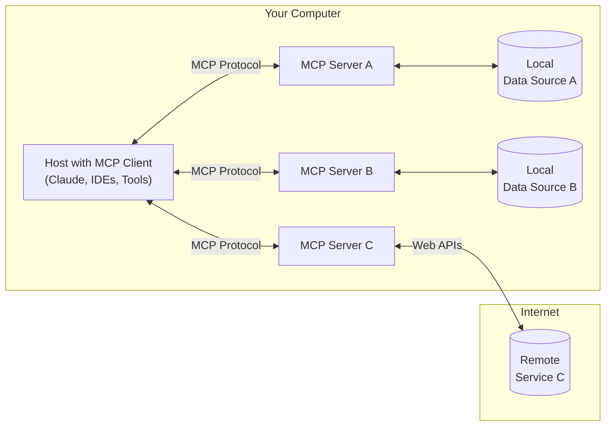
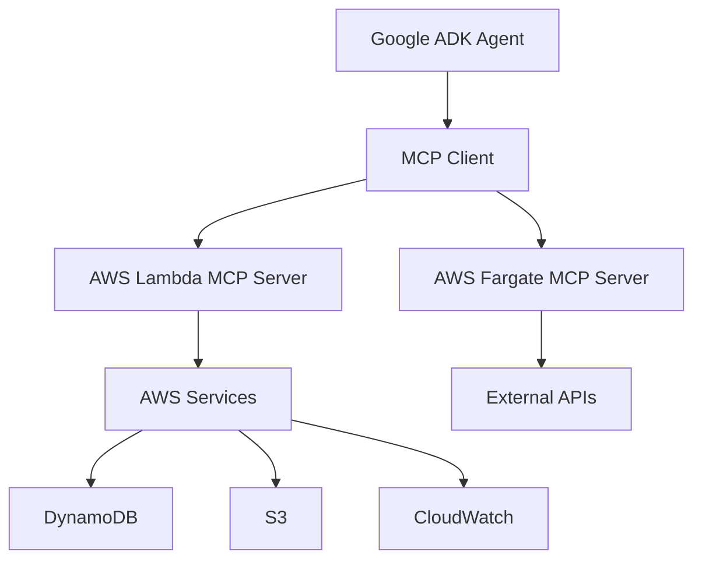

# Cost-Efficient MCP Server Deployment on AWS for AI Agents

A comprehensive guide to deploying Model Context Protocol (MCP) servers on AWS services cost-effectively and integrating them with AI agent frameworks like Google ADK.

## Table of Contents

1. [Overview](#overview)
2. [MCP Architecture Fundamentals](#mcp-architecture-fundamentals)
3. [AWS Deployment Options](#aws-deployment-options)
4. [Cost Comparison Analysis](#cost-comparison-analysis)
5. [Recommended Deployment Strategies](#recommended-deployment-strategies)
6. [Google ADK Integration](#google-adk-integration)
7. [Implementation Examples](#implementation-examples)
8. [Monitoring and Optimization](#monitoring-and-optimization)
9. [Best Practices](#best-practices)
10. [Resources](#resources)

## Overview

The Model Context Protocol (MCP) is an open standard that enables AI applications to connect securely to external data sources and tools. This guide focuses on cost-efficient deployment strategies for MCP servers on AWS and their integration with AI agent frameworks.

### Key Benefits of MCP
- **Standardized Integration**: Consistent interface for AI models to interact with external tools
- **Real-Time Communication**: Server-Sent Events (SSE) support for live data exchange
- **Secure and Auditable**: Built-in access control and logging
- **Highly Extensible**: Easy integration with various tools and services

## MCP Architecture Fundamentals



### Core Components
- **MCP Host**: The LLM-powered application (Claude, Google ADK agents)
- **MCP Client**: Maintains 1:1 connection with MCP Server
- **MCP Server**: Supplies context, tools, and prompts to the client

## AWS Deployment Options

### 1. AWS Lambda (Serverless) - **RECOMMENDED FOR COST EFFICIENCY**

**Pros:**
- Pay only for execution time (no idle costs)
- Automatic scaling
- No server management
- Ideal for variable/unpredictable workloads
- Cold start optimizations available

**Cons:**
- 15-minute execution limit
- Cold start latency (100ms-5 seconds)
- Limited to 10GB memory
- Complex for long-running processes

**Best For:**
- Event-driven MCP servers
- Sporadic usage patterns
- Cost-sensitive deployments
- Quick prototyping

### 2. AWS Fargate (Container-as-a-Service)

**Pros:**
- No execution time limits
- Better for long-running processes
- More control over runtime environment
- No cold starts once running
- Up to 120GB memory, 16 vCPU

**Cons:**
- Higher costs due to continuous resource allocation
- Longer startup times (35 seconds - 2 minutes)
- More complex setup
- Pay for allocated resources even if idle

**Best For:**
- Enterprise deployments requiring high availability
- Long-running MCP servers
- Complex security requirements
- Consistent workloads

### 3. Amazon ECS on EC2

**Pros:**
- Maximum control and customization
- Cost-effective for consistent high usage
- Can use Reserved Instances for savings

**Cons:**
- Requires server management
- Higher operational overhead
- Not truly serverless

**Best For:**
- High-volume, consistent workloads
- Custom infrastructure requirements

## Cost Comparison Analysis

### Lambda Pricing Model
```
Cost = (Number of Requests × $0.20 per 1M requests) + 
       (Duration × Memory × $0.0001667 per GB-second)
```

**Example**: 1M requests/month, 1GB memory, 2-second average duration
- Requests: 1M × $0.20/1M = $0.20
- Compute: 1M × 2s × 1GB × $0.0001667 = $333.40
- **Total: ~$333.60/month**

### Fargate Pricing Model
```
Cost = (vCPU hours × $0.04048) + (GB memory hours × $0.004445)
```

**Example**: 1 vCPU, 2GB memory, running 24/7
- vCPU: 744 hours × $0.04048 = $30.12
- Memory: 744 hours × 2GB × $0.004445 = $6.61
- **Total: ~$36.73/month**

### Cost Optimization Recommendations

| Usage Pattern | Recommended Service | Estimated Monthly Cost |
|---------------|-------------------|----------------------|
| < 1M requests/month, sporadic | Lambda | $50-200 |
| 1-10M requests/month, variable | Lambda | $200-1000 |
| > 10M requests/month, consistent | Fargate | $100-500 |
| Enterprise, 24/7 availability | Fargate + Load Balancer | $500-2000 |

## Recommended Deployment Strategies

### Strategy 1: Pure Lambda Serverless (Most Cost-Efficient)

```python
# Basic MCP Server on Lambda
import json
import asyncio
from mcp.server import Server
from mcp.server.stdio import stdio_server
import mcp.types as types

app = Server("aws-lambda-mcp-server")

@app.list_tools()
async def list_tools() -> list[types.Tool]:
    return [
        types.Tool(
            name="aws-cost-analyzer",
            description="Analyze AWS costs and usage",
            inputSchema={
                "type": "object",
                "properties": {
                    "service": {"type": "string"},
                    "region": {"type": "string"}
                }
            }
        )
    ]

@app.call_tool()
async def call_tool(name: str, arguments: dict) -> list[types.TextContent]:
    if name == "aws-cost-analyzer":
        # Implement cost analysis logic
        result = analyze_aws_costs(arguments)
        return [types.TextContent(type="text", text=result)]
    
    raise ValueError(f"Unknown tool: {name}")

def lambda_handler(event, context):
    # Lambda handler implementation
    return asyncio.run(handle_mcp_request(event))
```

### Strategy 2: Fargate for Enterprise (High Availability)

```yaml
# docker-compose.yml for Fargate deployment
version: '3.8'
services:
  mcp-server:
    build: .
    ports:
      - "8080:8080"
    environment:
      - AWS_REGION=us-east-1
      - LOG_LEVEL=INFO
    healthcheck:
      test: ["CMD", "curl", "-f", "http://localhost:8080/health"]
      interval: 30s
      timeout: 10s
      retries: 3
```

### Strategy 3: Hybrid Approach

- **Lambda**: For lightweight, event-driven MCP tools
- **Fargate**: For resource-intensive, long-running MCP servers
- **API Gateway**: For HTTP-based MCP server endpoints

## Google ADK Integration

### Architecture Overview



### ADK Agent Configuration

```python
# Google ADK agent with MCP integration
from google.adk import Agent, Tool
from mcp_client import MCPClient

class AWSMCPTool(Tool):
    def __init__(self):
        self.mcp_client = MCPClient()
        super().__init__(
            name="aws-mcp-tool",
            description="Access AWS services via MCP server"
        )
    
    async def execute(self, **kwargs):
        # Connect to MCP server on AWS
        await self.mcp_client.connect("https://your-mcp-server.amazonaws.com")
        
        # Execute tool via MCP
        result = await self.mcp_client.call_tool(
            name="aws-cost-analyzer",
            arguments=kwargs
        )
        
        return result

# ADK Agent setup
agent = Agent(
    name="AWS Cost Assistant",
    model="gemini-2.0-flash-exp",
    tools=[AWSMCPTool()],
    instructions="You are an AWS cost optimization assistant..."
)
```

### Multi-Agent Collaboration

```python
# Multi-agent setup with MCP
from google.adk.a2a import AgentCommunication

# Cost Analysis Agent
cost_agent = Agent(
    name="Cost Analyzer",
    tools=[AWSCostMCPTool()],
    instructions="Analyze AWS costs and identify optimization opportunities"
)

# Resource Optimization Agent
optimize_agent = Agent(
    name="Resource Optimizer", 
    tools=[AWSResourceMCPTool()],
    instructions="Implement cost optimization recommendations"
)

# A2A Communication
comm = AgentCommunication([cost_agent, optimize_agent])

# Workflow
async def cost_optimization_workflow(query):
    # Step 1: Analyze costs
    analysis = await cost_agent.process(query)
    
    # Step 2: Get optimization recommendations
    recommendations = await optimize_agent.process(analysis)
    
    return recommendations
```

## Implementation Examples

### 1. AWS Lambda MCP Server with CDK

```typescript
// CDK Infrastructure
import * as cdk from 'aws-cdk-lib';
import * as lambda from 'aws-cdk-lib/aws-lambda';
import * as apigateway from 'aws-cdk-lib/aws-apigateway';

export class MCPServerStack extends cdk.Stack {
  constructor(scope: Construct, id: string, props?: cdk.StackProps) {
    super(scope, id, props);

    // Lambda function for MCP server
    const mcpServer = new lambda.Function(this, 'MCPServer', {
      runtime: lambda.Runtime.PYTHON_3_11,
      handler: 'mcp_server.lambda_handler',
      code: lambda.Code.fromAsset('src'),
      timeout: cdk.Duration.minutes(15),
      memorySize: 1024,
      environment: {
        LOG_LEVEL: 'INFO'
      }
    });

    // API Gateway for HTTP access
    const api = new apigateway.RestApi(this, 'MCPServerAPI', {
      restApiName: 'MCP Server Service'
    });

    const integration = new apigateway.LambdaIntegration(mcpServer);
    api.root.addMethod('POST', integration);
  }
}
```

### 2. Fargate MCP Server with High Availability

```yaml
# AWS ECS Task Definition
version: '1'
taskDefinition:
  family: mcp-server
  networkMode: awsvpc
  requiresCompatibilities:
    - FARGATE
  cpu: '256'
  memory: '512'
  containerDefinitions:
    - name: mcp-server
      image: your-account.dkr.ecr.region.amazonaws.com/mcp-server:latest
      portMappings:
        - containerPort: 8080
          protocol: tcp
      environment:
        - name: AWS_REGION
          value: us-east-1
      logConfiguration:
        logDriver: awslogs
        options:
          awslogs-group: /ecs/mcp-server
          awslogs-region: us-east-1
          awslogs-stream-prefix: ecs
```

### 3. Cost Optimization MCP Server

```python
# AWS Cost Analysis MCP Server
import boto3
from datetime import datetime, timedelta
from mcp.server import Server
import mcp.types as types

app = Server("aws-cost-mcp-server")

@app.list_tools()
async def list_tools():
    return [
        types.Tool(
            name="get-cost-breakdown",
            description="Get AWS cost breakdown by service",
            inputSchema={
                "type": "object",
                "properties": {
                    "days": {"type": "integer", "default": 30},
                    "granularity": {"type": "string", "enum": ["DAILY", "MONTHLY"]}
                }
            }
        ),
        types.Tool(
            name="identify-unused-resources",
            description="Identify unused AWS resources",
            inputSchema={
                "type": "object",
                "properties": {
                    "services": {"type": "array", "items": {"type": "string"}}
                }
            }
        )
    ]

@app.call_tool()
async def call_tool(name: str, arguments: dict):
    ce_client = boto3.client('ce')  # Cost Explorer
    
    if name == "get-cost-breakdown":
        end_date = datetime.now()
        start_date = end_date - timedelta(days=arguments.get('days', 30))
        
        response = ce_client.get_cost_and_usage(
            TimePeriod={
                'Start': start_date.strftime('%Y-%m-%d'),
                'End': end_date.strftime('%Y-%m-%d')
            },
            Granularity=arguments.get('granularity', 'MONTHLY'),
            Metrics=['BlendedCost'],
            GroupBy=[{'Type': 'DIMENSION', 'Key': 'SERVICE'}]
        )
        
        # Process and format results
        cost_breakdown = format_cost_data(response)
        
        return [types.TextContent(
            type="text",
            text=f"AWS Cost Breakdown:\n{cost_breakdown}"
        )]
    
    elif name == "identify-unused-resources":
        # Implement unused resource identification
        unused_resources = find_unused_resources(arguments.get('services', []))
        
        return [types.TextContent(
            type="text", 
            text=f"Unused Resources Found:\n{unused_resources}"
        )]
```

## Monitoring and Optimization

### CloudWatch Dashboards

```json
{
  "widgets": [
    {
      "type": "metric",
      "properties": {
        "metrics": [
          ["AWS/Lambda", "Duration", "FunctionName", "mcp-server"],
          ["AWS/Lambda", "Invocations", "FunctionName", "mcp-server"],
          ["AWS/Lambda", "Errors", "FunctionName", "mcp-server"]
        ],
        "period": 300,
        "stat": "Average",
        "region": "us-east-1",
        "title": "MCP Server Lambda Metrics"
      }
    }
  ]
}
```

### Cost Alerts

```python
# CloudWatch Cost Alarm
import boto3

cloudwatch = boto3.client('cloudwatch')

cloudwatch.put_metric_alarm(
    AlarmName='MCP-Server-High-Cost',
    ComparisonOperator='GreaterThanThreshold',
    EvaluationPeriods=1,
    MetricName='EstimatedCharges',
    Namespace='AWS/Billing',
    Period=86400,
    Statistic='Maximum',
    Threshold=100.0,
    ActionsEnabled=True,
    AlarmActions=[
        'arn:aws:sns:us-east-1:123456789012:billing-alerts'
    ],
    AlarmDescription='Alert when MCP server costs exceed $100'
)
```

## Best Practices

### 1. Cost Optimization
- **Use Lambda for sporadic workloads** (< 1M requests/month)
- **Use Fargate for consistent workloads** (> 10M requests/month)
- **Implement proper caching** to reduce redundant API calls
- **Use AWS Savings Plans** for predictable workloads
- **Monitor and set cost alerts**

### 2. Performance Optimization
- **Minimize Lambda cold starts** with provisioned concurrency
- **Use connection pooling** for database connections
- **Implement proper error handling and retries**
- **Use CloudWatch insights** for performance monitoring

### 3. Security Best Practices
- **Use IAM roles** with least privilege principle
- **Enable VPC endpoints** for secure AWS service access
- **Implement proper authentication** for MCP endpoints
- **Use AWS WAF** for API protection
- **Enable CloudTrail** for audit logging

### 4. Scalability Considerations
- **Design for horizontal scaling**
- **Use SQS for async processing**
- **Implement circuit breakers** for external API calls
- **Use Auto Scaling** for Fargate deployments

## Resources

### Official Documentation
- [Model Context Protocol Specification](https://modelcontextprotocol.io/)
- [AWS Lambda Documentation](https://docs.aws.amazon.com/lambda/)
- [AWS Fargate Documentation](https://docs.aws.amazon.com/AmazonECS/latest/developerguide/AWS_Fargate.html)
- [Google ADK Documentation](https://developers.google.com/adk)

### Sample Implementations
- [AWS Labs MCP Servers](https://github.com/awslabs/mcp)
- [MCP Python SDK](https://github.com/modelcontextprotocol/python-sdk)
- [AWS Serverless MCP Examples](https://github.com/aws-samples/sample-serverless-mcp-servers)

### Cost Calculators
- [AWS Lambda Pricing Calculator](https://aws.amazon.com/lambda/pricing/)
- [AWS Fargate Pricing Calculator](https://aws.amazon.com/fargate/pricing/)

### Community Resources
- [MCP Registry](https://github.com/modelcontextprotocol/registry)
- [AWS Serverless Patterns](https://serverlessland.com/patterns)

---

## Conclusion

For most use cases, **AWS Lambda provides the most cost-efficient deployment option** for MCP servers, especially for variable workloads and development environments. For enterprise deployments requiring high availability and consistent performance, **AWS Fargate offers better reliability** at a higher cost.

The integration with Google ADK framework enables powerful multi-agent workflows that can leverage AWS services cost-effectively while maintaining the flexibility and standardization that MCP provides.

Choose your deployment strategy based on:
- **Traffic patterns** (sporadic vs. consistent)
- **Cost sensitivity** (development vs. production)
- **Performance requirements** (latency vs. throughput)
- **Operational complexity** (managed vs. self-managed)

Start with Lambda for prototyping and cost optimization, then consider Fargate for production workloads requiring higher availability and performance guarantees.
